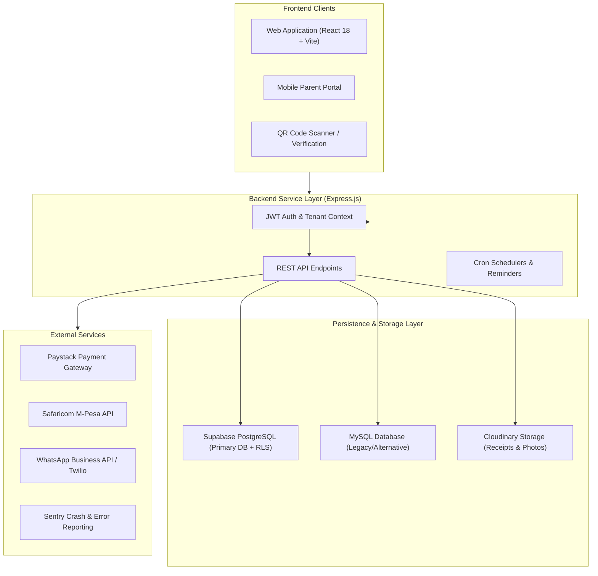

# EduCore School Management System — Complete System Documentation

---

## 📋 Table of Contents
1. [System Overview & Key Capabilities](#1-system-overview--key-capabilities)
2. [Architecture & Technology Stack](#2-architecture--technology-stack)
3. [Multi-Tenant Security & Data Isolation](#3-multi-tenant-security--data-isolation)
4. [Comprehensive Module Breakdown](#4-comprehensive-module-breakdown)
   - [Authentication & User Roles](#41-authentication--user-roles)
   - [Academic Management](#42-academic-management)
   - [Student Information System (SIS) & Admissions](#43-student-information-system-sis--admissions)
   - [Examinations, Grading & Report Cards](#44-examinations-grading--report-cards)
   - [Finance, Fee Management & Accounting](#45-finance-fee-management--accounting)
   - [Expenditures & Asset Management](#46-expenditures--asset-management)
   - [Staff, HR & Payroll Management](#47-staff-hr--payroll-management)
   - [Attendance & QR Scanning Verification](#48-attendance--qr-scanning-verification)
   - [Multi-Channel Communication & WhatsApp Suite](#49-multi-channel-communication--whatsapp-suite)
   - [Library & Resource Management](#410-library--resource-management)
   - [Student & Parent Portals](#411-student--parent-portals)
   - [College & Higher Education Module](#412-college--higher-education-module)
   - [Multi-Branch Administration](#413-multi-branch-administration)
5. [API Endpoint Reference Architecture](#5-api-endpoint-reference-architecture)
6. [Database Schema & Data Models](#6-database-schema--data-models)
7. [Installation, Setup & Deployment Guide](#7-installation-setup--deployment-guide)
8. [Operations, Monitoring & Maintenance](#8-operations-monitoring--maintenance)

---

## 1. System Overview & Key Capabilities

**EduCore** is a multi-tenant, cloud-native **School Management System (SMS)** engineered for primary schools, high schools, colleges, and multi-branch educational networks. The platform streamlines school administration, academic record-keeping, financial operations, staff management, and parent-school communication within a single, secure web application.

### Key Capabilities:
- **Multi-Tenant SaaS Architecture**: Built from the ground up to support multiple schools with isolated tenant data (`school_id`), Row-Level Security (RLS), and custom configurations.
- **Financial & Accounting Suite**: Double-entry general ledger, balance sheet, trial balance, automated invoicing, fee discounts, fee blocks, M-Pesa automated reconciliation, Paystack gateway, and expenditure tracking with receipt uploads.
- **Academic Engine**: Flexible grading scales, class rankings, compiled exam analytics, KNEC performance sheets, term/year management, and PDF report card generation.
- **Smart Attendance & ID Cards**: QR-code-based student/staff ID card generation, web camera QR scanner, and automated attendance logging.
- **Multi-Channel Communication**: In-app notifications, broadcast announcements, automated fee reminders, SMS integration, and per-school WhatsApp Business API integration.
- **Comprehensive Portals**: Dedicated, mobile-friendly interfaces for Admins, Teachers, Students, and Parents.
- **Higher-Ed / College Capabilities**: Support for departments, degree/diploma programs, units, and semester enrollments alongside K-12 schooling structures.

---

## 2. Architecture & Technology Stack



### Technology Breakdown:
- **Frontend Framework**: React 18, Vite build tool, React Router DOM v7.
- **UI & Styling**: Custom responsive components, Lucide React icons, Tailwind CSS / custom design tokens.
- **Backend Runtime**: Node.js with Express.js REST framework.
- **Database Layer**: PostgreSQL via Supabase (primary production layer with Row-Level Security) and Node-MySQL driver support.
- **Authentication**: JsonWebToken (JWT) with password hashing (Bcrypt).
- **File Uploads**: Cloudinary integration for storage of uploaded payment receipts, logos, and documents.
- **Monitoring & Crash Reporting**: `@sentry/react` and `@sentry/node`.

---

## 3. Multi-Tenant Security & Data Isolation

Data privacy and tenant isolation are enforced across all layers of the EduCore architecture:

1. **Database Level Isolation (Supabase RLS)**:
   - Row Level Security (RLS) is enabled across system tables (`students`, `teachers`, `payments`, `attendance`, `results`, `announcements`, etc.).
   - Access policies strictly verify the tenant claim:
     ```sql
     (auth.jwt() ->> 'school_id')::bigint = school_id
     ```
2. **Backend Middleware Enforcement**:
   - `tenantContext` and `tenantSecurityCheck` middleware extract and validate the `school_id` claim from JWT tokens on every incoming request.
   - All backend SQL queries append `WHERE school_id = $1` to guarantee zero cross-tenant data leakage.
3. **Role-Based Access Control (RBAC)**:
   - Built-in permission checks restrict API access based on assigned user roles.

---

## 4. Comprehensive Module Breakdown

### 4.1 Authentication & User Roles
EduCore supports granular Role-Based Access Control (RBAC):
- **Super Admin / System Director**: Global system oversight, school onboarding, license management.
- **School Admin / Principal**: Full administrative control over school settings, academics, finance, and staff.
- **Teacher / Educator**: Class roster access, mark entry, attendance recording, lesson plan management.
- **Accountant / Bursar**: Financial ledger management, fee collection, invoicing, expenditure approvals.
- **Librarian**: Book cataloging, issuance, fine collection.
- **HR Manager**: Staff records, leave tracking, payroll generation.
- **Student**: View personal grades, timetables, fee balance, library books.
- **Parent / Guardian**: View student academic performance, fee statements, pay fees online, receive school announcements.

---

### 4.2 Academic Management
- **Academic Years & Terms**: Define academic sessions, start/end dates, and set current active terms.
- **Classes & Streams**: Configure grade levels (e.g., Grade 1 to Form 4) and multiple streams per class.
- **Subject Allocation**: Assign core and elective subjects to classes and specific teachers.
- **Lesson Plans**: Digital creation, submission, and administrative review of teacher lesson plans.
- **Academic Promotion**: Automated end-of-year promotion engine to transition students to subsequent grade levels.

---

### 4.3 Student Information System (SIS) & Admissions
- **Student Profiling**: Comprehensive records including admission number, UPI, birth date, guardian details, medical history, and status (Active, Transferred, Graduated).
- **Bulk CSV/Excel Import**: Import hundreds of student records with automatic validation.
- **QR-Coded ID Cards**: Automatic generation of printable Student ID cards embedded with QR codes for fast verification.
- **Disciplinary Records**: Track student discipline events, actions taken, and notify parents.

---

### 4.4 Examinations, Grading & Report Cards
- **Exam Types & Scheduling**: Configure CATs, Mid-Term, End-of-Term, and Mock examinations.
- **Flexible Grading Scales**: Custom percentage ranges mapped to letter grades (A, B, C, D, E) and points.
- **Automated Ranking**: Compute total marks, mean scores, overall rank, and stream rank instantly.
- **KNEC Performance Sheets**: Standardized evaluation sheets aligned with national curriculum guidelines.
- **Report Card Engine**: Generate customized, downloadable PDF report cards with teacher/principal remarks.

---

### 4.5 Finance, Fee Management & Accounting
- **Fee Structures**: Define fee categories by class, term, boarder status, or custom groups.
- **Invoicing & Discounts**: Bulk invoice generation with support for fee waivers, scholarships, and early-bird discounts.
- **Fee Reminders**: Queue and send automated SMS/WhatsApp fee reminders to parents with outstanding balances.
- **Automated Payment Processing**:
  - **Paystack Integration**: Online credit/debit card and mobile money payments with instant reconciliation.
  - **M-Pesa Reconciliation**: Integration with Safaricom M-Pesa API for automated C2B/STK Push payment matching.
- **Double-Entry General Ledger**:
  - Chart of Accounts
  - Journal Entries
  - Trial Balance
  - Income Statement (Profit & Loss)
  - Balance Sheet

---

### 4.6 Expenditures & Asset Management
- **Expense Logging**: Record school operational costs categorized by department or project.
- **Receipt Uploads**: Cloudinary-powered receipt image attachment for audit compliance.
- **Approval Workflow**: Multi-tier expense approval (`Pending`, `Approved`, `Rejected`) managed by Bursar/Principal.
- **Financial Analytics**: Visual breakdown of revenue vs. expenditure.

---

### 4.7 Staff, HR & Payroll Management
- **Staff Directory**: Detailed employee profiles, designations, contracts, and contact info.
- **Teacher Class Assignment**: Assign subjects and class teacher responsibilities.
- **Payroll Processing**: Salary computation, tax/benefit deductions, payslip generation, and disbursement tracking.

---

### 4.8 Attendance & QR Scanning Verification
- **Daily Attendance Marking**: Quick digital roll-call for morning and afternoon sessions.
- **Web QR Scanner**: Built-in scanner using device camera to scan student/staff QR ID cards for instant check-in/check-out.
- **Parent Alerts**: Automated notifications when a student is marked absent or arrives at school.

---

### 4.9 Multi-Channel Communication & WhatsApp Suite
- **Announcements System**: Broadcast targeted updates to all staff, specific classes, or parents.
- **WhatsApp Business API Integration**:
  - Per-school WhatsApp configuration (API keys, phone numbers).
  - Send direct exam reports, fee statements, and urgency notifications via WhatsApp.
- **SMS Gateway**: Integration for reliable text messaging.

---

### 4.10 Library & Resource Management
- **Book Cataloging**: Manage book inventory, ISBNs, quantities, and authors.
- **Issue & Return Tracking**: Track borrowed books, due dates, and calculate overdue fines.

---

### 4.11 Student & Parent Portals
- **Parent Portal (Mobile Optimized)**: Dedicated responsive interface allowing parents to view real-time fee balances, pay fees via M-Pesa/Paystack, download report cards, and view attendance logs.
- **Student Portal**: Student access to class timetables, assignments, and exam results.

---

### 4.12 College & Higher Education Module
- **Higher-Ed Hierarchy**: Manage Academic Departments, Degree/Diploma/Certificate Programs, and Course Units.
- **Semester Enrollments**: Manage course unit registrations, GPA calculations, and credit hours.

---

### 4.13 Multi-Branch Administration
- **Branch Selector**: Switch context between different school campuses/branches under a single network.
- **Consolidated & Branch-Level Reporting**: Filter financial and academic statistics by specific branch or consolidated network totals.

---

## 5. API Endpoint Reference Architecture

The EduCore API routes are mounted under `/api` in `backend/src/app.js`:

| Endpoint Prefix | Description | Key Capabilities |
|-----------------|-------------|------------------|
| `/api/auth` | Authentication | Login, JWT generation, password resets, session check |
| `/api/students` | Student SIS | CRUD students, bulk import, QR generation |
| `/api/classes` | Classes & Streams | Manage grade levels and classroom streams |
| `/api/subjects` | Subject Catalog | Manage subjects and teacher allocations |
| `/api/exams` | Examination Engine | Exam setup, marks entry, class ranking |
| `/api/grades` | Grading Management | Grading scales, student report card data |
| `/api/payments` | Fee Collection | Record cash/bank payments, view transaction histories |
| `/api/invoices` | Invoicing | Issue term fee invoices, view balances |
| `/api/expenditures` | Expenses | Log expenses, upload receipts, approval flow |
| `/api/accounts` | Accounting | Chart of accounts, general ledger, trial balance |
| `/api/attendance` | Attendance System | Mark attendance, QR code scanning verification |
| `/api/hr` | Staff & Payroll | Staff directory, leave tracking, payroll slips |
| `/api/communication`| Messaging | Send SMS, in-app notifications, announcements |
| `/api/integrations` | External APIs | WhatsApp Business settings, M-Pesa configuration |
| `/api/mpesa` | M-Pesa Gateway | C2B callbacks, STK Push request handling |
| `/api/paystack` | Paystack Gateway | Initialize payment, webhook verification |
| `/api/library` | Library | Book catalog, loan issuing, fine tracking |
| `/api/branch` | Branch Management | Multi-campus operations and selector |
| `/api/health` | System Health | API status check, database connection test |

---

## 6. Database Schema & Data Models

The database contains over 45 tenant-aware tables. Key primary models include:

- `schools`: Primary tenant registry containing school branding, contact details, and license plan.
- `users`: Accounts with hashed passwords, assigned roles, and `school_id`.
- `students`: Admission numbers, personal details, current `class_id`, `stream_id`, and `school_id`.
- `teachers`: Staff credentials, department, assigned classes, and contact info.
- `classes` / `streams`: Academic structure for grouping students.
- `exams` / `results`: Exam metadata and individual subject score entries per student.
- `fee_structures` / `invoices` / `payments`: Financial ledger tracking fees billed and payments collected.
- `expenditures`: Expense records with approval status and receipt URL links.
- `announcements`: School updates filtered by role or grade level.
- `attendance`: Date-stamped attendance logs linked to student ID and `school_id`.

---

## 7. Installation, Setup & Deployment Guide

### Prerequisites
- **Node.js**: v18.x or v20.x
- **Database**: PostgreSQL (via Supabase) or MySQL (v8.0+)
- **NPM**: v9.x+

### 7.1 Environment Configuration
1. **Frontend (`.env`)**:
   ```env
   VITE_API_URL=http://localhost:4000/api
   VITE_SUPABASE_URL=your_supabase_project_url
   VITE_SUPABASE_ANON_KEY=your_supabase_anon_key
   ```
2. **Backend (`backend/.env`)**:
   ```env
   PORT=4000
   NODE_ENV=development
   JWT_SECRET=your_jwt_secret_key
   DATABASE_URL=your_postgresql_connection_string
   CLOUDINARY_CLOUD_NAME=your_cloudinary_name
   CLOUDINARY_API_KEY=your_cloudinary_key
   CLOUDINARY_API_SECRET=your_cloudinary_secret
   PAYSTACK_SECRET_KEY=your_paystack_secret
   ```

### 7.2 Running Locally
1. **Start Backend**:
   ```bash
   cd backend
   npm install
   npm run dev
   ```
   *Backend runs at `http://localhost:4000`*

2. **Start Frontend**:
   ```bash
   # From root directory
   npm install
   npm run dev
   ```
   *Frontend runs at `http://localhost:5173`*

### 7.3 Running Tests
```bash
# Run grading and ranking test suite
npm test
```

---

## 8. Operations, Monitoring & Maintenance

- **Error Tracking**: Connected to **Sentry** for real-time frontend and backend error diagnostics.
- **Health Verification**: Monitor `/api/health` for automated uptime ping checks.
- **Database Migrations**: SQL schema migrations are located in `backend/migrations/` and `database/`.
- **Database Backups**: Managed via Supabase automated snapshots or script-assisted automated backups in `backend/scripts/`.

---
*EduCore SMS Documentation Manual — Version 2.0*
